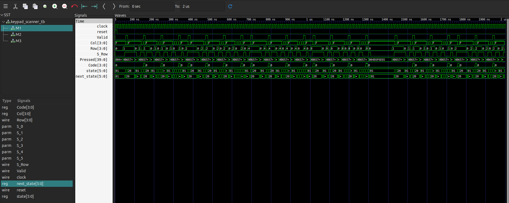

# 4×4 Hexadecimal Keypad Scanner

A Verilog implementation of a **4×4 hexadecimal keypad scanner** using a finite state machine (FSM). The design scans the keypad matrix by sequentially activating each column, detecting the corresponding row, and decoding the pressed key into its hexadecimal value (0–F).

The project demonstrates fundamental digital design concepts including finite state machines, combinational logic, sequential logic, synchronization, modular RTL design, and functional verification.

---

## Features

- 4×4 hexadecimal keypad support (0–F)
- Matrix keypad scanning
- One-hot encoded FSM
- Two-stage synchronizer for asynchronous row inputs
- Hexadecimal key decoding
- Valid signal generation
- Verilog testbench for functional verification
- GTKWave waveform analysis

---

## Keypad Layout

```
         Col0  Col1  Col2  Col3

Row0       0     1     2     3
Row1       4     5     6     7
Row2       8     9     A     B
Row3       C     D     E     F
```

---

## Architecture

```
                    +----------------------+
                    |      Testbench       |
                    +----------+-----------+
                               |
                               v
                    +----------------------+
                    |     Row_Scanner      |
                    +----------+-----------+
                               |
                               v
                    +----------------------+
                    |    Synchronizer      |
                    +----------+-----------+
                               |
                               v
                    +----------------------+
                    |    Keypad Encoder    |
                    |  (FSM + Decoder)     |
                    +----------+-----------+
                               |
                   +-----------+-----------+
                   |                       |
                   v                       v
              Code[3:0]                Valid
```

---

## Finite State Machine

The controller operates using a one-hot encoded finite state machine.

| State | Description |
|------|-------------|
| S0 | Wait for a key press |
| S1 | Scan Column 0 |
| S2 | Scan Column 1 |
| S3 | Scan Column 2 |
| S4 | Scan Column 3 |
| S5 | Wait until the pressed key is released |

During operation, each column is activated sequentially. When a row becomes active, the row-column combination uniquely identifies the pressed key.

---

## Project Structure

```
hexadecimal-keypad-scanner/
│
├── rtl/
│   ├── keypad_encoder.v
│   ├── Row_Scanner.v
│   └── Synchronizer.v
│
├── tb/
│   └── keypad_scanner_tb.v
│
├── images/
│   └── gtkwave_simulation.png
│
├── README.md
└── .gitignore
```

---

## Module Description

### keypad_encoder

- Implements the keypad scanning FSM
- Activates keypad columns sequentially
- Decodes row-column combinations
- Generates hexadecimal output
- Produces a valid output signal

### Row_Scanner

- Models the electrical behavior of the keypad matrix
- Determines the active row corresponding to the currently scanned column

### Synchronizer

- Two-stage flip-flop synchronizer
- Synchronizes asynchronous row inputs to the system clock
- Reduces the probability of metastability

---

## Simulation

### Compile

```bash
iverilog -o keypad_sim rtl/*.v tb/keypad_scanner_tb.v
```

### Run Simulation

```bash
vvp keypad_sim
```

### View Waveforms

```bash
gtkwave dump.vcd
```

---

## Simulation Result



---

## Tools Used

- Ubuntu 24.04 LTS
- Visual Studio Code
- Verilog HDL
- Icarus Verilog
- GTKWave
- Git
- GitHub

---

## Concepts Demonstrated

- Finite State Machines (FSM)
- One-Hot State Encoding
- Matrix Keypad Scanning
- Combinational Logic
- Sequential Logic
- Clock Domain Synchronization
- RTL Design
- Functional Verification
- Testbench Development

---

## Future Improvements

- Key debounce implementation
- Parameterizable keypad dimensions
- FPGA implementation using Xilinx Vivado
- SystemVerilog assertions for verification
- Constrained-random verification
- Support for interrupt generation

---

## Author

**Vamshidhar Reddy**

GitHub: https://github.com/vamshi2007
